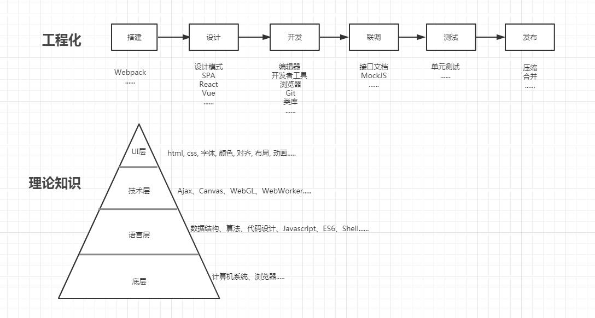

# 前端知识库

## 理论知识

### 底层    
* 浏览器
    * 模块
    * 解析
    * 排版
    * 绘制
    
### 语言层
* 数据结构
    * 集合
    * 线性结构
        * 数组
        * 栈
        * 线性表
    * 树形结构
        * 堆
    * 图形结构
* 代码
    * 变量命名    
    * 逻辑控制
        * 条件判断
        * 循环
        * 递归        
    * 代码组织
        * 继承
        * MVC    
* 算法    
    * 查找
        * 遍历查找
        * 递归查找
        * 二分查找
    * 插入        
    * 删除
        * 创建新空间;        
    * 拷贝
        * 浅拷贝
        * 深拷贝
    * 排序    
    * 乱序
        * 循环随机
        * Fisher-Yates shuffle
    * 合并        
    * 去重
        * 排序前后比较
        * 对象存储法    
    * 求和        
    * 最值   
    * 防抖
    * 节流
    * 扁平
    * 柯里

* JavaScript
    * 语法
    * 变量
    * 执行环境
        * 作用域
            * 作用域链
        * 垃圾回收
    * 数据类型
        * typeof
        * Undefined
        * Null
        * Number
        * Boolean        
        * String
        * Object
    * 表达式  
    * 函数
        * 递归
        * 闭包
        * 原型
            * 原型链
        * argument
    * DOM
        * 节点类型
        * 操作
            * 选择
            * 增加
            * 删除
            * 更新
    * 事件
        * 事件流
        * 事件对象
        * 事件委托
    * BOM
        * Window
        * Location
        * History
        * Nagatior
        * FileReader

    * 正则
        * 符号        
* ES6    
    * set和map
    * import和require
    * 箭头函数    
    * promise
    * proxy和反射接口    
    * asyns、await    
    * 迭代器
        * yield
    * module
    * class
* Node     
    * 环境
        * 运行环境
        * NPM        
    * 基础知识
        * 计时器
        * _filename和_dirname
    * 模块列表
        * Buffer
        * 文件系统
        * 数据库
            * MangoDB
            * Mysql
            * HTTP
    * 进程和子进程
    * 调试        

### 技术层

* 通信
    * URL
        * 格式
        * 编码
        * 解码
    * Http
        * 流程
        * 请求头
        * 返回值
        * 状态码        
    * Ajax                
    * Fetch
    * WebSocket
    * WebRTC
    * Server Worker    
* 格式
    * JSON
        * 格式规范
        * parse
        * stringify
    * XML        
* 存储
    * Cookie        
    * Storage
        * Localstorage
        * SessionStorage
        * CachaStorage        
    * IndexDB
* 图形
    * Canvas
        * 坐标
        * 样式
        * 绘制
            * 文字
            * 形状
                * 线
                    * 直线
                    * 曲线
                * 矩形
                * 圆形            
            * 图片        
        * 动画
            * 线性动画
            * 非线性动画
        * 碰撞检测  
    * WebGL
        * 着色器
            * 着色器语言
            * 点着色器
            * 片着色器                           
        * 绘制
        * 高级转换和动画基础
        * 三维
            * 视点
        * 光线
    * SVG
        * 标签  
        * 坐标系统
        * 绘制
            * 基本形状             
            * 图案
        
### UI层  
* HTML
    * 语义化
    * 文档模型
    * meta
    * viewpoint  
* CSS
    * 盒模型     
    * 选择器                
    * 权值 
    * CSS3
    * CSS Sprite
    * Flex
    * 动画
    * 滤镜
* 字体
* 颜色
* 布局
    * 多列布局
    * 瀑布流
* 技巧
    * 滑动门

## 工程化

1. 环境搭建
    * 脚手架
        * Webpack
        * Rollup
        * Babel
    * NPM
    * KOA
    * Express   
2. 设计
    * 设计模式
    * SPA
    * 模块化
        * require
        * import 
    * 框架
        * Jquery   
        * React
            * Redux    
            * React Native
        * Vue        
        * Less
        * SASS
        * POSTCSS
        * ANT DESIGN
        * Element
    * 项目任务分解    
3. 开发
    * 编辑器
        * VSCode
    * Git
4. 联调
    * Chrome Developer
    * 接口文档
    * 性能优化
5. 测试
    * 单元测试
    * Web安全
        * XSS
    * Code Review
## 类库
* 轮播图
    * swiper.js
* 数据处理
    * underscore.js
    * moment.js
* 图表
    * echarts.js
* 图形
    * openCV.js
    * testflow.js
    * faceAPI.js
    * pico.js